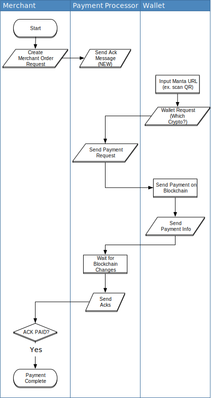

================
 Manta Protocol
================

Manta is designed to be a safe, crypto agnostic, privacy
friendly payment protocol.

Glossary
========

Manta defines the transaction flow between three entities:

.. glossary::

 POS
 Store
 Merchant
   It's the initiator of the single payment transaction. It requires
   that some amount of money is paid by a **Wallet** and to do so it
   exchanges messages only with a **Payment Processor**. It's also called
   **Store** in the code.

 Payment Processor
   As the name suggests, it manages the payment
   process in its entirety. The other two parties never communicate
   directly but they exchange messages with it.

 Wallet
   End user who visits merchant’s web site, orders goods and/or
   service and pays for it.

Technologies Used
=================

.. glossary::

 JSON
   `JavaScript Object Notation`_ is de facto standard for data
   serialization, and was standardized as :rfc:`8259`.

 MQTT
   `Message Queuing Telemetry Transport`_ is an ISO standard (ISO/IEC PRF 20922)
   publish-subscribe-based messaging protocol.

   Information exchange is organized in *topics* and clients
   communicates directly only with the *broker* service. A client can
   instruct the broker to *retain* a published message so that it can
   be delivered to future subscribers whose subscriptions match its
   topic name.

.. _Message Queuing Telemetry Transport:
.. _mqtt: http://docs.oasis-open.org/mqtt/mqtt/v3.1.1/os/mqtt-v3.1.1-os.html

.. _JavaScript Object Notation: https://json.org

Communication protocol
======================

Standard `MQTT`:term: is used for communication between all the three
parties. The exchanged messages are encoded in :term:`JSON` format.

   High level overview of Manta Protocol

..  toctree::

    protocol/parameters
    protocol/flow
    protocol/messages
    protocol/topics
